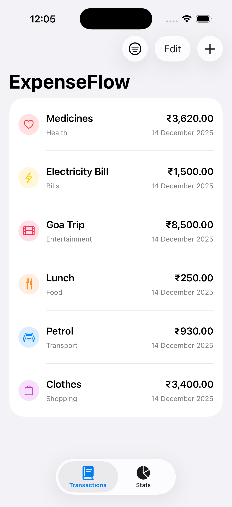
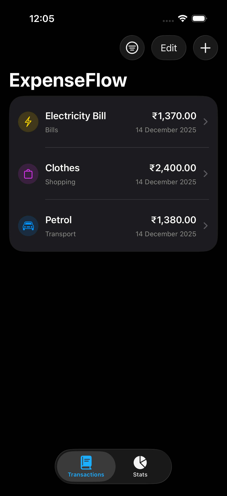
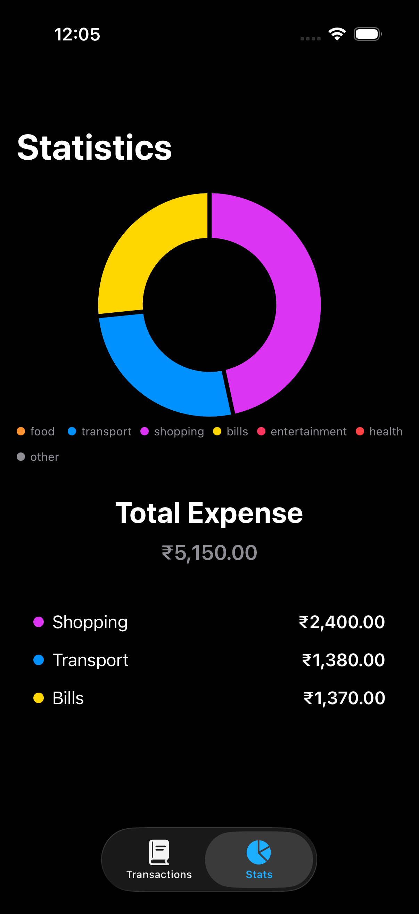
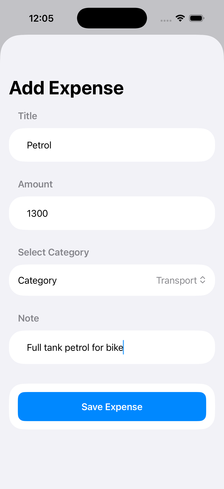
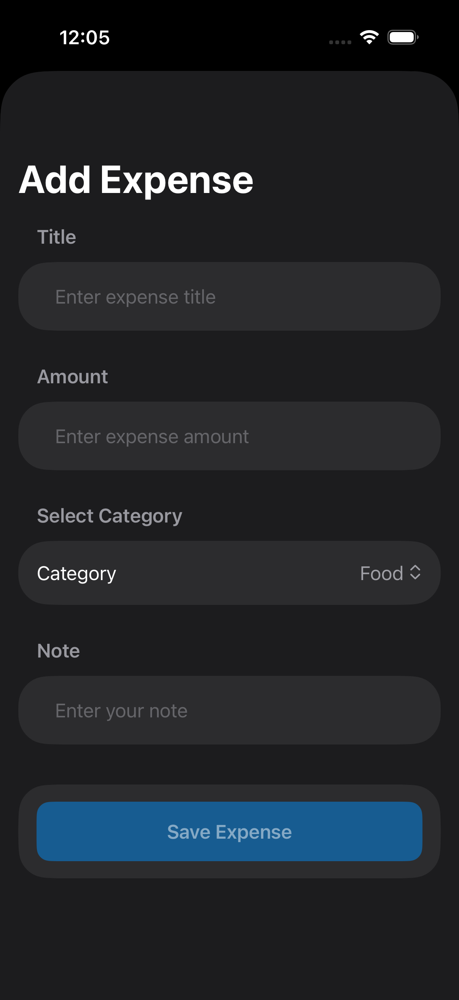
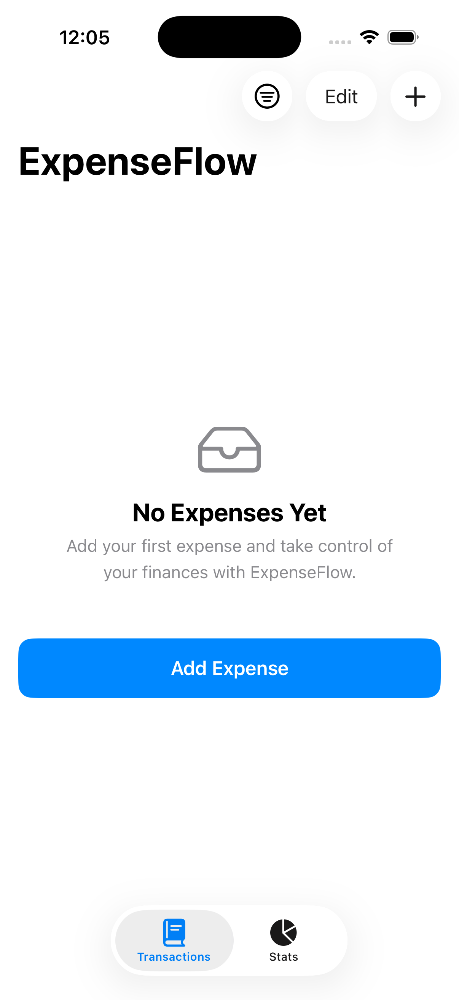
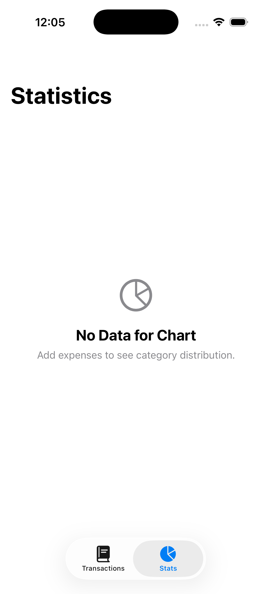
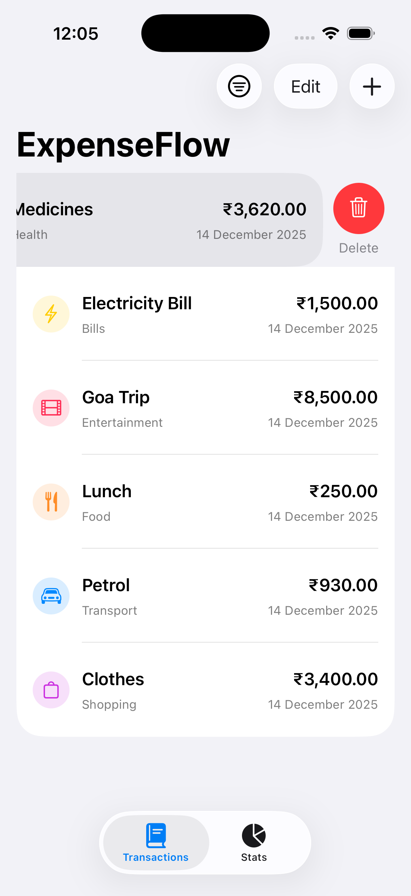
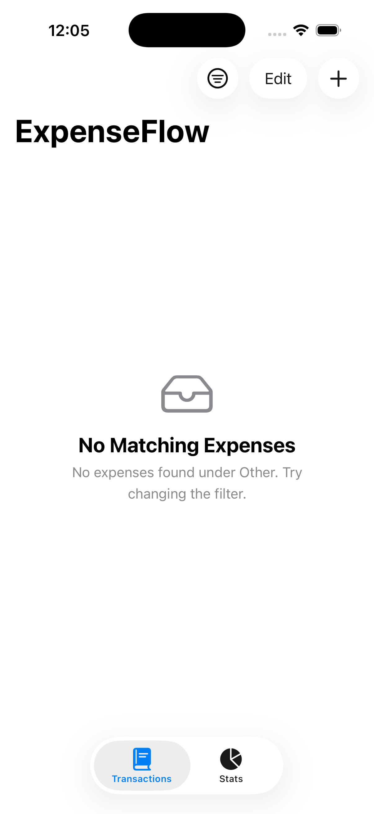

# 💸 ExpenseFlow

**ExpenseFlow** is a modern iOS expense tracker app built using **SwiftUI**, **MVVM**, and **Core Data**, designed to help users track, analyze, and visualize their daily spending with ease.

---

## ✨ Features

- 📋 Add, edit, and delete expenses
- 🗂 Categorize expenses (Food, Travel, Shopping, Bills, Other)
- 🔍 Filter expenses
  - All
  - Today
  - This Month
  - By Category
- 📊 Interactive pie (donut) chart
  - Category-wise expense distribution
  - Total expense displayed at the center
- 📈 Statistics screen
- 🧾 Expense detail view
- 🧠 Smart empty states using `ContentUnavailableView`
- 🎨 Modern UI with glass (Material) effects
- 💾 Persistent storage using Core Data

---

## 🏗 Architecture

The app follows **MVVM (Model–View–ViewModel)** architecture.

---

## 📊 Charts & Analytics

- Built using **Swift Charts**
- Donut-style pie chart (`SectorMark`)
- Category-based color mapping
- Dynamic updates based on applied filters

---

## 🧠 Key Technologies

- SwiftUI
- Swift Charts
- Core Data
- MVVM
- Combine (where required)
- iOS 16+

---

## 🖼 UI Highlights

- Glassmorphism using `.ultraThinMaterial`
- Adaptive light and dark mode
- Native navigation with `NavigationStack`
- Swipe-to-delete support
- Clean, Apple-style UI

---

## 🚀 Future Enhancements

- Monthly and yearly analytics
- Budget limits and alerts
- Export expenses (CSV / PDF)
- iCloud sync
- iPad-optimized layout

---

## 🧑‍💻 Author

**Sajan Lawrence**  
iOS Developer | SwiftUI | UIKit | Core Data

---

## 📸 Screenshots

<table>
  <tr>
      <td align="center">
      <strong>Expense List</strong> 
      
    </td>
      <td align="center">
      <strong>Expense List Dark Mode</strong> 
      
    </td>
    <td align="center">
      <strong>Statistics View</strong> 
      
    </td>
        <td align="center">
      <strong>Statistics View Dark Mode</strong> 
      
    </td>
  </tr>
  <tr>
    <td align="center">
      <strong>Add Expense View</strong> 
      
    </td>
    <td align="center">
      <strong>Add Expense View Dark Mode</strong> 
      
    </td>
        <td align="center">
      <strong>No Expense View</strong> 
      
    </td>
            <td align="center">
      <strong>No Statistics View</strong> 
      
    </td>
  </tr>
    <tr>
    <td align="center">
      <strong>Filter View</strong> 
      
    </td>
    <td align="center">
      <strong>Edit View</strong> 
      
    </td>
        <td align="center">
      <strong>Delete View</strong> 
      
    </td>
            <td align="center">
      <strong>No Matching Filter View</strong> 
      
    </td>
  </tr>
</table>
